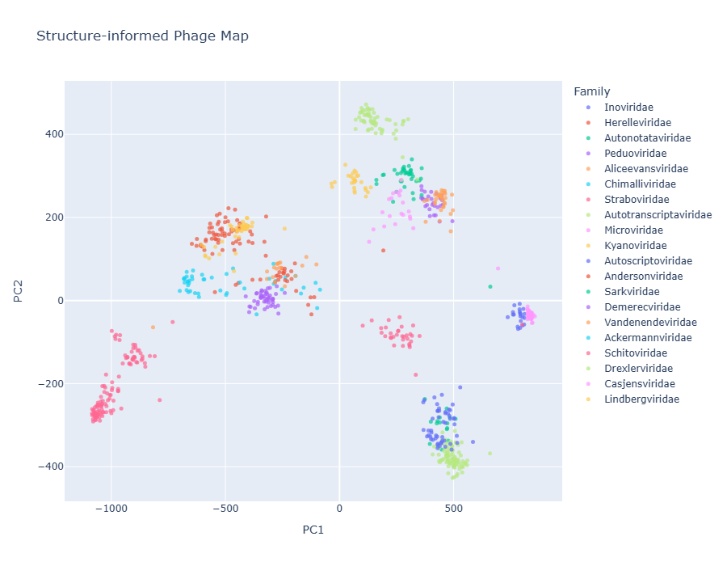
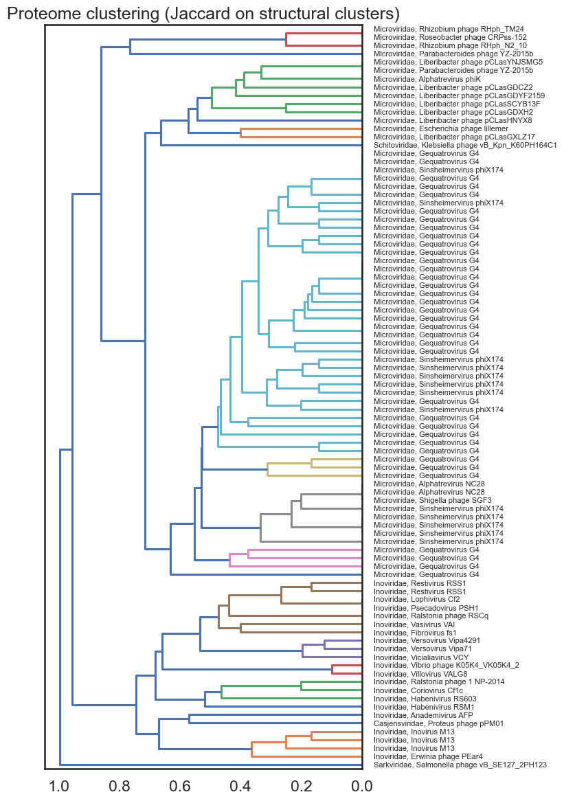

Here is a recreation of the structure-informed map from Litvin U. et. al. Viro3D: a comprehensive database of virus protein structure predictions. Mol Syst Biol (2025). https://doi.org/10.1038/s44320-025-00147-9.

The code was written from the ground up. The dataset, consists of 898 phages, with a total of 105,965 proteins.

Accessions of all viruses with a complete nucleotide, which have bacteria as a host (phages) were downloaded from NCBI Virus [`ncbi_phage_metadata.tsv`](data/ncbi_phage_metadata.tsv). From this phage list, the top 20 families with the most entries were selected. Next, 10% of phages in these families were chosen at random, and their proteomes downloaded from NCBI. This amounted to 898 phages, with a total of 105,965 proteins.

Following, stuctures for all proteins were predicted using ESM3. The structures were then sujected to an all vs. all alignment using Foldseek. From this alignment, a mapping of each phage to every protein structure is constructed, effectivly creating an embedding vector of e-values for every phage. This is used as the input for PCA.

PDB files and alignment can be downloaded [here](https://drive.google.com/drive/folders/1MT68k_iFRtcIM1r8XzpKdH7B-yPq6C5w?usp=sharing)

At the end we have a plot showing the similarity of phages, based on their protein structures.

View the interactive plot [`data/phage_PCA_interactive.html`](data/phage_PCA_interactive.html) [here](https://dottting.github.io/phage_structure_map/data/phage_PCA_interactive.html), or in the Jupyter Notebook [`plot.ipynb`](notebooks/plot.ipynb).



## Analysis

The [`analysis`](notebooks/analysis.ipynb) notebook gives a basis for furhter investigation for clusters of interest. See [`plot`](notebooks/plot.ipynb) or [here](data/map_clusters.png) for cluster ids.

This notebook:

- Fetches accessions in the selected cluster(s), optionally outputs a .txt file of them.
- Searches for alignments between proteins within the cluster(s), from the all vs all foldseek alignment.
- Builds a protein-protein graph (can be stored seperately), and detects communities within it.
- Creates a dentrogram tree based on Jaccard similarity



# Usage

Install the conda `environment.yml`:

```bash
conda env create -f environment.yml
conda activate phagemap
```

#### Input data

If using the phagomics pipeline:

- Run [`notebooks/handle_pipeline_output.ipynb`](notebooks/handle_pipeline_output.ipynb) to get a tar.gz file of all protein structures.
- Then, run `$ foldseek easy-search all_pdbs.tar.gz all_pdbs.tar.gz foldseek_allvsall.tsv tmp --format-output query,target,evalue,bits,alntmscore` to create an all vs. all alignment of protein structures.

Otherwise, make sure you have the following files:

- All vs. all alignment of protein structures in .tsv format. See foldseek command above.
- Phage metadata in .tsv format with the following information: Accession, Species, Family

Then,

1. Run [`notebooks/data.ipynb`](notebooks/data.ipynb) which handles metadata and calculates PCA.
2. Run [`notebooks/plot.ipynb`](notebooks/plot.ipynb) to plot PCA resuts, with a static and interactive plot.
3. Run [`notebooks/analysis.ipynb`](notebooks/analysis.ipynb), to investigate clusters of interest.
